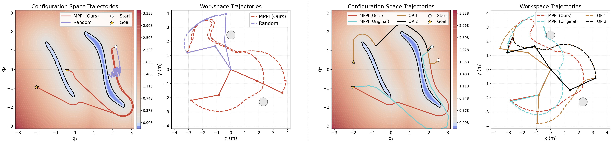
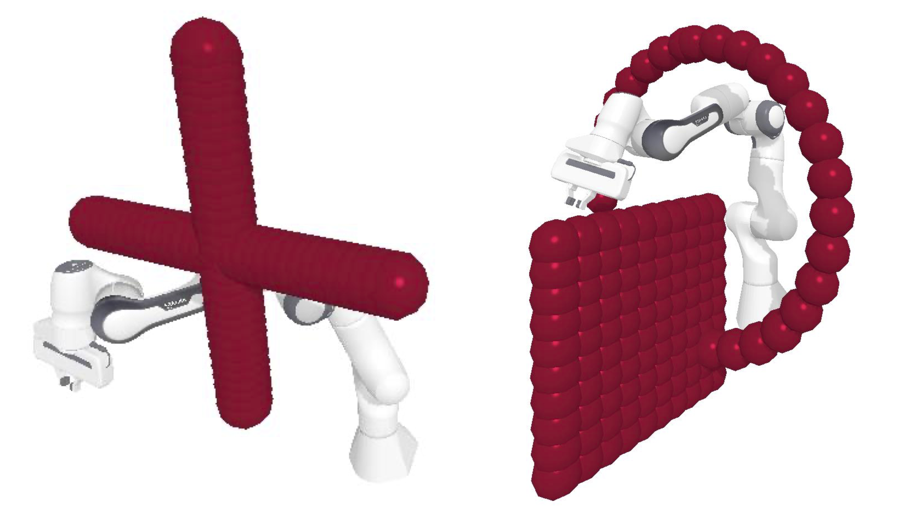

# CDF-MPPI: Motion Planning with Configuration Space Distance Fields

## Advantages
- **Avoiding local optima**: The method eliminates optimization-based procedures, reducing the risk of convergence to local minima.  
- **Unified cost function**: An angle-based cost function integrates goal-seeking and obstacle avoidance into a single metric with consistent units.  
- **Computational efficiency**: By leveraging CDF gradients, the MPPI horizon can be reduced to one step ($H=1$), significantly lowering computation time while maintaining safety.  

## Results

### 2D Two-Link Robot
- Success rate: **99.2%**  
- Outperforms QP and original MPPI in robustness  
- Slightly longer but safer trajectories  

  

  <em>Comparison of trajectories in configuration space (left) and workspace (right).</em>

| Method | Success Rate (%) | Path Length | Avg. Steps |
|--------|------------------|-------------|------------|
| MPPI (Ours) | 99.2 | 5.09 | 241 |
| MPPI (Original) | 71.2 | 4.40 | 155 |
| QP (IPOPT) | 64.1 | 3.75 | 107 |

---

### 7-DOF Franka Robot
- Achieves **>750 Hz** control frequency  
- Significantly higher success rate than QP and original MPPI in challenging environments  

  

  <em>Comparison of trajectories in two scenarios with the 7-DOF Franka robot.</em>

| Method | Succ. (%) | Len. | Hz |
|--------|-----------|------|------|
| MPPI (Ours) | 100 / 83.8 | 4.57 / 7.85 | 776 / 718 |
| QP (IPOPT) | 13.0 / 14.0 | 4.30 / 6.74 | 222 / 228 |
| MPPI (Original) | - | - | 61 / 28 |

---
